# NORTH AI - Multi-Agent Orchestration Template

> **Intelligent AI assistant with multi-agent architecture, vector search, and multimodal processing capabilities**

NORTH is a production-minded template/demo for a small construction/real-estate team. It provides natural language access to company knowledge across multiple data sources through specialized AI agents, each optimized for specific tasks.

> Publication note: This repo ships as a skills template. Keep secrets out of git, set your own `NORTH_MASTER_KEY`/`NORTH_KDF_SALT`, and verify external services (Weaviate, Supabase, Dropbox) are reachable before demos. See `SECURITY.md` for quick safety guidelines.

**Live-Ready Architecture** | **Multi-Agent Orchestration** | **Vector Database** | **Multimodal Processing**

---

## 🎯 Problem & Solution

**The Challenge:**
Construction companies accumulate thousands of documents (contracts, invoices, insurance forms) and contractor records across disconnected systems (Obsidian vaults, Dropbox folders). Finding specific information requires manual searching through inconsistent file structures and remembering exact contractor names.

**The Solution:**
NORTH provides a unified conversational interface that:
- Understands natural language queries ("Who did electrical work on Regency?")
- Searches across structured knowledge bases and unstructured documents simultaneously
- Routes queries to specialized agents optimized for different data sources
- Processes images, PDFs, and spreadsheets alongside text queries

**Notes on Demo Data & Metrics:**
- Numbers (e.g., 180 contractor records, 1,174 docs) reflect a prior deployment snapshot; replace with your data.
- Response times (1-5s) are typical for LLM + vector search but not measured in this repo.
- Streaming is demo-style (progress + final chunk), not token-level.
- Supabase service role key is used server-side; keep the API private or swap to anon+RLS if exposing.
- Tests are minimal (health/auth-required + manual smoke scripts); use the evaluation harness for deeper checks.

---

## 🏗️ Architecture

### Multi-Agent Orchestration

NORTH uses an **agent-per-tool architecture** where each data source has a dedicated agent with specialized prompts and optimization strategies:


**Why This Matters:**
- **Cost Optimization**: Strategic model selection ($0.15/1M vs $5/1M tokens)
- **Specialized Optimization**: Each agent tuned for its data characteristics
- **Independent Scaling**: Agents can be modified without affecting the orchestrator
- **Graceful Degradation**: System remains functional if individual agents fail

### Technical Stack

**Backend:**
- **LLM Framework**: LangChain with OpenAI models
- **Vector Database**: Weaviate v4 (Cloud for production, Docker for local development)
- **Embeddings**: Voyage AI `voyage-3-large` (2048 dimensions) via Weaviate's built-in integration
- **Reranking**: Voyage AI `rerank-2.5` for search result optimization
- **Document Processing**: PyPDF2 and python-docx for PDF/document parsing
- **API**: FastAPI with WebSocket support for simulated streaming/progress
- **Authentication**: JWT-based auth with Supabase integration

**Frontend:**
- **Framework**: React 18 with TypeScript
- **Styling**: Tailwind CSS with responsive design
- **Real-time**: WebSocket connections for progress + final responses (demo streaming)
- **File Upload**: Multipart form data with drag-and-drop support

**Infrastructure:**
- **Hosting**: Render (frontend + backend)
- **Database**: Weaviate Cloud ($25/month)
- **Auth Provider**: Supabase with email whitelist
- **Repository**: [GitHub](https://github.com/even-a-worm-will-turn/NORTH-AI)

---

## 🚀 Key Features

### 1. **Hybrid Vector Search**
Combines semantic understanding with keyword matching for superior retrieval:
- **BM25 + Dense Vectors**: Weaviate's alpha-weighted hybrid search
- **Entity Extraction**: LLM-based query understanding for contractors, projects, and document types
- **Reranking**: Voyage AI rerank-2.5 for result optimization
- **Property Filtering**: Direct access to structured metadata (tags, dates, costs)

**Example Query Flow:**

```mermaid
graph TD
    A["User Query:<br/>'Who did electrical<br/>work on Regency?'"]
    B["Semantic Understanding:<br/>[electrical contractors,<br/>project=Regency]"]
    C["Hybrid Search:<br/>Dynamic alpha<br/>(0.3-0.7 tuning)"]
    D["Rerank Top 10<br/>→ Return Top 3"]
    E["Response:<br/>'Triple Eagle Electric<br/>(Tom, 555-1234)'"]

    A --> B --> C --> D --> E

    style A fill:#FFF9C4,stroke:#F9A825,stroke-width:2px,color:#000
    style B fill:#E1F5FE,stroke:#0288D1,stroke-width:2px,color:#000
    style C fill:#E8F5E9,stroke:#388E3C,stroke-width:2px,color:#000
    style D fill:#F3E5F5,stroke:#7B1FA2,stroke-width:2px,color:#000
    style E fill:#C8E6C9,stroke:#2E7D32,stroke-width:2px,color:#000
```


### 2. **Multimodal Processing**
Full support for images, documents, and spreadsheets:
- **Image Analysis**: Construction photos, damage assessment, site plans
- **PDF Processing**: Contract extraction, invoice parsing, insurance documents
- **Spreadsheet Analysis**: Excel/CSV data interpretation
- **Vision API**: GPT-4o's native vision capabilities for image understanding

**Use Case Example:**
> User uploads photo of water damage → NORTH identifies issue type → Routes to Obsidian agent for contractor recommendations → Returns 3 qualified plumbers with contact info and past project history

### 3. **Context-Aware Conversations**
Maintains conversation history for follow-up queries:
- **Message Persistence**: LangChain conversation buffer with configurable limits
- **Context Injection**: Previous exchanges inform current query understanding
- **Smart Routing**: Agent selection based on conversation flow
- **Clear Context API**: User control over conversation reset

### 4. **Production Authentication**
Secure access control for authorized users only:
- **JWT Tokens**: Signed tokens with expiration validation
- **Email Whitelist**: Authorized company emails + creator (placeholder domain)
- **Environment-Aware**: Dev mode bypasses auth, production enforces strict validation
- **WebSocket Security**: Token-based authentication for real-time connections

**Security Implementation:**
```python
# Exception order matters: ExpiredSignatureError is subclass of InvalidTokenError
try:
    payload = jwt.decode(token, secret, algorithms=["HS256"],
                        options={"verify_signature": True})
except jwt.ExpiredSignatureError:  # Caught BEFORE parent class
    raise HTTPException(status_code=401, detail="Token has expired")
except jwt.InvalidTokenError:
    raise HTTPException(status_code=401, detail="Invalid token")
```

---

## 📊 Data & Performance

### Indexed Content
- **Obsidian Vault**: 180 documents (153 companies, 25 work logs)
- **Dropbox Storage**: 1,174 files (1.47 GB) across projects
- **Vector Database**: ~5,000 vectors (0.25% of 2M tier capacity)
- **Embedding Model**: Voyage AI voyage-3-large (automatic via Weaviate)
- **Verification**: Run `python scripts/data_profile.py` (with Weaviate reachable) to print current collection counts; figures above reflect the last production sync.

### Response Characteristics
- **Query Latency**: 1-5 seconds for complex queries (typical for LLM + vector search + document retrieval)
- **Hybrid Search**: BM25 + semantic with configurable alpha weighting
- **Reranking**: Top-k optimization for relevance
- **Incremental Sync**: Dropbox cursor-based updates (no full re-index)

**Note on Performance**: Response times are inherent to the architecture (GPT-4o inference, Weaviate semantic search, Dropbox API calls). This is acceptable for an internal tool where accuracy matters more than speed. For real-time consumer applications, additional optimization would be needed.

### Cost Optimization
- **Orchestrator**: GPT-4o for complex routing ($5/1M tokens)
- **Specialized Agents**: GPT-4o-mini for structured data ($0.15/1M tokens)
- **Embeddings**: Weaviate-managed Voyage AI (included in $25/month)
- **Hosting**: Render free tier + $25/month Weaviate Cloud

---

## 🛠️ Local Development

### Prerequisites
- Python 3.9+
- Docker Desktop (for local Weaviate instance)
- OpenAI API key
- Obsidian vault (optional for knowledge base testing)

### Setup

1. **Clone and install dependencies:**
   ```bash
   git clone <repository-url>
   cd NORTH
   pip install -r requirements.txt
   ```

2. **Start local Weaviate instance:**
   ```bash
   docker run -d -p 8080:8080 -p 50051:50051 \
     -e AUTHENTICATION_ANONYMOUS_ACCESS_ENABLED=true \
     -e ENABLE_MODULES=text2vec-openai \
     --name weaviate_north semitechnologies/weaviate:latest
   ```

3. **Configure environment variables:**
   ```bash
   cp .env.example .env
   # Edit .env with your API keys:
   # - OPENAI_API_KEY (required)
   # - OBSIDIAN_VAULT_PATH (optional)
   # - DROPBOX_APP_KEY, DROPBOX_APP_SECRET, DROPBOX_REFRESH_TOKEN (for auto Dropbox token refresh)
   # - DROPBOX_ACCESS_TOKEN (optional; will be auto-managed once refresh token is set)
   # - DISABLE_AUTH_VERIFICATION=true (for local dev)
   ```

4. **Run NORTH CLI:**
   ```bash
   python main.py
   ```

   On first run, NORTH automatically initializes the Weaviate schema and connects to your local instance.

### Environment Auto-Detection

NORTH automatically switches between local and production configurations:

```python
# All Weaviate-connected files use this pattern:
if os.getenv("WEAVIATE_URL") and os.getenv("WEAVIATE_API_KEY"):
    client = weaviate.connect_to_weaviate_cloud(...)  # Production
else:
    client = weaviate.connect_to_local(...)           # Local Docker
```

**Local Mode**: No authentication, Docker Weaviate, development logging
**Production Mode**: JWT auth, Weaviate Cloud, structured logging

---

## 💻 Usage

### Interactive CLI
```bash
python main.py
```

**Example Queries:**
```
> Who was the electrician for 305 Regency?
NORTH: Triple Eagle Electric handled the electrical work for 305 Regency.
       Contact: Tom (555-123-4567)

> Find the signed contract with Triple Eagle
NORTH: [Dropbox Agent] Found 2 contracts:
       1. /Projects/Regency/Active/Triple_Eagle/Contract_Signed_2024.pdf
       2. /Projects/Regency/Completed/Triple_Eagle/Final_Invoice.pdf

> [Attach image of water damage]
> What type of contractor do I need?
NORTH: [Vision Analysis] This appears to be water damage affecting drywall.
       [Knowledge Base] I recommend these plumbers from our database:
       1. AquaFix Plumbing (555-234-5678) - handled similar repairs
       2. Premier Water Solutions (555-345-6789) - insurance certified
```

### Available Commands
- `python main.py` - Interactive mode (default)
- `python main.py sync` - Sync Obsidian vault changes to Weaviate
- `python main.py --help` - Show available commands

### In-Chat Commands
- `sync` - Trigger Obsidian vault sync while running
- `quit` or `exit` - Exit NORTH

---

## 🌐 Deployment (example)

### Live System (example)
- **URL**: https://example-ai.com (placeholder)
- **Hosting**: Render (auto-deploy from GitHub)
- **Authentication**: Supabase with email whitelist enforcement
- **Vector Database**: Weaviate Cloud (production tier)

### Deployment Process
1. **Push to GitHub**: Backend updates trigger automatic Render deployment
2. **Frontend Changes**: Detected via `/frontend` folder modifications
3. **Environment Variables**: Configured in Render dashboard (secrets never committed)
4. **Database Migration**: Weaviate Cloud auto-detects schema changes

### Configuration Management
- **Development**: `.env` file with local settings + `DISABLE_AUTH_VERIFICATION=true`
- **Production**: Render environment variables + Weaviate Cloud credentials
- **Authentication**: JWT secrets managed via Supabase
- **Supabase Service Role (backend-only)**: The API uses `SUPABASE_SERVICE_KEY` for trusted server-side inserts. Keep the API private and enforce auth; swap to anon key + RLS if exposing directly.

### Monitoring & Logs
- **Backend Logs**: Render dashboard with structured logging
- **Vector Database**: Weaviate Cloud monitoring console
- **Error Tracking**: FastAPI exception handlers with detailed error messages

### Caveats / Placeholders
- WebSocket “streaming” is demo-style (progress events + final response), not token-level streaming.
- CORS origins and domains are placeholders; set real origins before deploying.
- Replace example company/domain data for production use.

---

## 🧪 Testing & Validation

### Manual Testing Checklist
- [x] JWT authentication with expired token handling
- [x] WebSocket connections with token validation
- [x] Multimodal file upload (images, PDFs, spreadsheets)
- [x] Context persistence across conversation turns
- [x] Agent routing for different query types
- [x] Error handling for service unavailability
- [x] Environment auto-detection (local vs production)

### Key Test Cases
```bash
# Test authentication
curl -X POST http://localhost:8000/api/auth/login \
  -H "Content-Type: application/json" \
  -d '{"email": "authorized@example.com", "password": "test123"}'

# Test multimodal upload
curl -X POST http://localhost:8000/api/chat/with-files \
  -H "Authorization: Bearer <token>" \
  -F "message=What's in this image?" \
  -F "files=@damage_photo.jpg"

# Test context management
curl -X POST http://localhost:8000/api/clear-context \
  -H "Authorization: Bearer <token>"
```

### Manual Smoke Scripts (env-driven, no hardcoded credentials)
- Auth smoke: `python supabase/scripts/manual/auth_smoke.py` (requires `NORTH_SMOKE_EMAIL`, `NORTH_SMOKE_PASSWORD`)
- Conversation storage smoke: `python supabase/scripts/manual/conversation_storage_smoke.py` (requires `SUPABASE_SERVICE_KEY`)
- Profile helper: `python supabase/scripts/manual/fix_user_profile.py`

### RAG Quality Evaluation

NORTH includes a comprehensive evaluation script that measures retrieval quality and agent orchestration performance:

```bash
# Run evaluation suite
python scripts/evaluate_retrieval.py

# Run with verbose output (shows full responses)
python scripts/evaluate_retrieval.py --verbose

# Save detailed results to JSON
python scripts/evaluate_retrieval.py --save
```

**What Gets Evaluated:**
- **Agent Routing Accuracy** - Does the right agent handle each query type?
- **Entity Recall** - Are expected entities (contractors, documents) found in responses?
- **Performance Metrics** - Latency, token usage, estimated costs
- **Category Breakdown** - Performance by query type (contractor lookup, document search, etc.)

**Example Output** (metrics vary based on which agents are available):
```
═══════════════════════════════════════════════════════════
📊 NORTH AI EVALUATION REPORT
═══════════════════════════════════════════════════════════

✨ Overall Metrics:
   • Total Tests: 13
   • Agent Routing Accuracy: 92.3% (example)
   • Average Entity Recall: 89.1% (example)
   • Average Latency: 1,234ms
   • Median Latency: 987ms
   • Total Tokens (estimated): 1,126
   • Estimated Cost: $0.0056

📂 Category Breakdown:
   • contractor_lookup: 100% accuracy, 95% recall
   • document_search: 100% accuracy, 91% recall
   • multi_source: 100% accuracy, 100% recall
```

**Test Categories:**
1. **Contractor Lookup** - "Who did electrical work on 305 Regency?"
2. **Contact Information** - "What's the phone number for Triple Eagle Electric?"
3. **Document Search** - "Find the signed contract with ABC Electric"
4. **Multi-Source Queries** - "Tell me about ABC Electric and show their contract"
5. **Conversational** - "Hello, can you help me?"

The evaluation script demonstrates:
- ✅ **Production mindset** - Quality assurance beyond implementation
- ✅ **RAG expertise** - Understanding retrieval evaluation, not just wiring APIs
- ✅ **Metrics-driven** - Quantifiable performance benchmarks
- ✅ **Automated testing** - Repeatable validation process

This differentiates NORTH from typical LLM wrapper projects by showing systematic quality assessment.

---

## 📁 Project Structure

```
NORTH/
├── src/
│   ├── core/
│   │   ├── north_orchestrator.py      # Main orchestration logic (GPT-4o)
│   │   ├── file_processor.py          # Multimodal file handling
│   │   └── context_manager.py         # Conversation history
│   ├── agents/
│   │   ├── obsidian/
│   │   │   └── atomic_document_agent.py    # Knowledge base agent (GPT-4o-mini)
│   │   └── dropbox_v2/
│   │       └── dropbox_weaviate_agent.py   # Document search agent
│   └── api/
│       └── auth.py                    # JWT authentication & validation
├── frontend/
│   ├── src/
│   │   ├── components/                # React UI components
│   │   ├── contexts/                  # Auth context provider
│   │   └── hooks/                     # WebSocket chat hook
│   └── package.json
├── api.py                             # FastAPI backend + WebSocket
├── main.py                            # CLI entry point
├── requirements.txt                   # Python dependencies
├── .env.example                       # Environment template
└── SYSTEM.md                          # Detailed system documentation
```

---

## 🔐 Security & Privacy

### Access Control
- **Authorized Users Only**: Whitelisted company emails + creator (placeholder domain)
- **JWT Validation**: Signed tokens with expiration checking
- **Environment-Based Auth**: Signature verification can be disabled only in development (guarded by environment checks)
- **WebSocket Security**: Token-based authentication for real-time connections

### Data Protection
- **No Public Chat/User Data Access**: Authentication required for chat and user-specific endpoints
- **Secrets Management**: API keys and tokens via environment variables (never committed)
- **Git Hygiene**: Sensitive files excluded via `.gitignore` (token caches, credentials)

### Authentication Implementation (demo vs production)
```python
# Environment-aware authentication
DISABLE_AUTH = os.getenv("DISABLE_AUTH_VERIFICATION", "false").lower() == "true"
ENVIRONMENT = os.getenv("ENVIRONMENT", "production").lower()

if DISABLE_AUTH and ENVIRONMENT != "development":
    raise RuntimeError("Auth verification disabled outside development")
elif DISABLE_AUTH:
    logger.warning("Auth verification DISABLED - local development only")
else:
    # Production: strict JWT validation with signature verification
    payload = jwt.decode(
        token,
        secret,
        algorithms=["HS256"],
        options={"verify_signature": True}
    )
```

### Dropbox Token Handling
- Automatic refresh via `src/agents/dropbox_v2/dropbox_token_manager.py` using `DROPBOX_APP_KEY`, `DROPBOX_APP_SECRET`, and `DROPBOX_REFRESH_TOKEN`.
- Access tokens are cached locally in `dropbox_token_cache.json` (ignored by git) and written back to `.env` in encrypted form; no tokens are committed to the repo.
- If you rotate credentials, delete the local cache file and re-run; the manager will fetch and re-encrypt a fresh token.

---

## 📋 Current Status

### ✅ Production Features (demo defaults)
- [x] **Multi-agent orchestration** with GPT-4o routing
- [x] **Obsidian knowledge base** with hybrid search (180 docs)
- [x] **Dropbox document search** with PyPDF2/python-docx parsing (1,174 files)
- [x] **Multimodal processing** (images, PDFs, spreadsheets)
- [x] **JWT authentication** with Supabase integration (required for application endpoints)
- [x] **Simulated WebSocket streaming** for real-time responses (demo word-chunking)
- [x] **Context management** with conversation history
- [x] **Environment auto-detection** (local vs production)
- [x] **Production deployment** on Render with Weaviate Cloud

### 🚧 In Development
- [ ] **Calendar integration** (scheduling and events)
- [ ] **Outlook integration** (email generation and sending)
- [ ] **Voice interface** (future consideration)
- [ ] **Mobile optimization** (responsive design improvements)

---

## 🎓 Technical Highlights for Recruiters

### Advanced Patterns Implemented
1. **Agent-per-Tool Architecture**: Strategic model selection (GPT-4o for orchestration, GPT-4o-mini for specialized tasks) optimizes cost-to-quality ratio by using cheaper models for routine data retrieval

2. **Hybrid Search Optimization**: Combined BM25 keyword matching with dense vector semantics (Weaviate alpha-weighted search) + Voyage AI reranking for superior retrieval

3. **Context-Aware Routing**: LangChain conversation buffer with multi-turn understanding enables follow-up queries without context loss

4. **Production Authentication (demo-guarded)**: JWT signature verification with subclass exception ordering; bypass only allowed in development

5. **Multimodal Processing**: GPT-4o vision API integration with file type detection (base64 encoding for images, PyPDF2 for documents, pandas for spreadsheets)

6. **Environment Abstraction**: Single codebase auto-detects local Docker vs production Weaviate Cloud via environment variables

7. **Graceful Degradation**: Agent unavailability handled with user-friendly error messages (e.g., "Docker needs to be started") instead of stack traces

8. **RAG Quality Evaluation**: Automated evaluation script measures agent routing accuracy, entity recall, and performance metrics across 13+ test cases covering contractor lookup, document search, and multi-source queries

### Production-Grade Practices
- **Cost Optimization**: $25/month infrastructure for 4-user production system
- **Security**: JWT required for application endpoints; signature verification can be disabled only in development (guarded by environment checks)
- **Quality Assurance**: Automated RAG evaluation with quantifiable metrics (routing accuracy, entity recall, latency)
- **Monitoring**: Structured logging with FastAPI exception handlers
- **Deployment**: Render deployment configs with manual or GitHub-linked deploys
- **Data Management**: Incremental sync (Dropbox cursor, Obsidian file hashing)

---

## 📚 Documentation

- **[SYSTEM.md](./SYSTEM.md)** - Comprehensive system documentation and architecture details
- **[.env.example](./.env.example)** - Environment configuration template with descriptions

---

## 📄 License

This project is a template for a small-team AI assistant deployment. All company names and domains can be replaced with your own.

---

## 👤 Contact

**Developer**: Ibraheem Khalil
**Email**: dev@example.com
**Production URL**: https://example-ai.com
**Repository**: https://github.com/even-a-worm-will-turn/NORTH-AI

---

**Built with**: OpenAI GPT-4o • LangChain • Weaviate • Voyage AI • FastAPI • React • Supabase • Render
